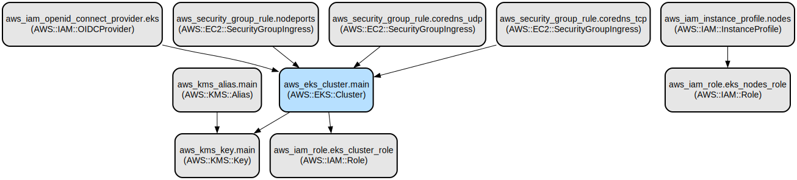

# AWS EKS Cluster Infrastructure as Code with Terraform

This project provides a comprehensive Infrastructure as Code (IaC) solution for deploying and managing an Amazon Elastic Kubernetes Service (EKS) cluster using Terraform. It implements secure, production-ready EKS infrastructure with encrypted storage, OIDC authentication, and proper IAM roles and security configurations.

The infrastructure includes a fully configured EKS cluster with node management, security groups, KMS encryption, and OIDC integration. It supports features such as cluster logging, zonal shift for high availability, and proper network segmentation using VPC subnets. The configuration follows AWS best practices for running containerized workloads in a production environment.

## Repository Structure
```
.
├── backend.tf          # S3 backend configuration for Terraform state
├── data.tf            # AWS SSM parameter store data source definitions
├── eks.tf             # EKS cluster configuration and settings
├── iam_cluster.tf     # IAM roles and policies for the EKS cluster
├── iam_nodes.tf       # IAM roles and policies for EKS worker nodes
├── kms.tf             # KMS key configuration for cluster encryption
├── oidc.tf           # OIDC provider setup for cluster authentication
├── providers.tf       # AWS provider configuration
├── sg.tf             # Security group rules for cluster networking
└── variables.tf       # Input variables for the Terraform configuration
```

## Usage Instructions
### Prerequisites
- AWS CLI configured with appropriate credentials
- Terraform >= 0.12.x
- AWS account with permissions to create:
  - EKS clusters
  - IAM roles and policies
  - KMS keys
  - Security groups
  - OIDC providers

### Installation

1. Clone the repository:
```bash
git clone <repository-url>
cd <repository-name>
```

2. Initialize Terraform:
```bash
terraform init
```

3. Configure required variables in a `terraform.tfvars` file:
```hcl
project_name        = "your-project-name"
region             = "your-aws-region"
ssm_vpc            = "ssm-parameter-for-vpc"
ssm_public_subnets = ["ssm-parameter-for-public-subnet-1", "ssm-parameter-for-public-subnet-2"]
ssm_private_subnets = ["ssm-parameter-for-private-subnet-1", "ssm-parameter-for-private-subnet-2"]
ssm_pods_subnets    = ["ssm-parameter-for-pod-subnet-1", "ssm-parameter-for-pod-subnet-2"]
k8s_version        = "1.24"
```

### Quick Start

1. Review the planned changes:
```bash
terraform plan
```

2. Apply the configuration:
```bash
terraform apply
```

3. After successful application, retrieve the cluster configuration:
```bash
aws eks update-kubeconfig --name <project_name> --region <region>
```

### More Detailed Examples

1. Creating an encrypted EKS cluster:
```hcl
module "eks" {
  source       = "./path/to/module"
  project_name = "encrypted-eks"
  k8s_version  = "1.24"
  region       = "us-west-2"
  # Add other required variables
}
```

2. Configuring cluster logging:
```hcl
# The cluster automatically enables logging for:
# - API server
# - Audit
# - Authenticator
# - Controller manager
# - Scheduler
```

### Troubleshooting

1. OIDC Provider Issues
- Error: "Error creating IAM OIDC Provider: InvalidInput: Thumbprint not valid for endpoint"
- Solution: Verify the OIDC thumbprint list is correct and includes both the dynamic and static values

2. Security Group Access
- Issue: Nodes cannot join cluster
- Check: Verify security group rules allow necessary communication:
```bash
aws eks describe-cluster --name <cluster-name> --query cluster.resourcesVpcConfig.clusterSecurityGroupId
```

3. IAM Role Permissions
- Issue: "User: is not authorized to perform: eks:CreateCluster"
- Solution: Ensure proper IAM permissions are attached to the deploying user/role

## Data Flow
The infrastructure sets up a secure EKS cluster with encrypted storage and proper network isolation. Data flows through secure channels with proper IAM authentication and authorization.

```ascii
                                    ┌─────────────────┐
                                    │   KMS Service   │
                                    └────────┬────────┘
                                            │
┌──────────────┐    ┌──────────────┐    ┌──┴───────────┐    ┌─────────────┐
│   AWS IAM    │────│  EKS Cluster │────│ Worker Nodes │────│   Secrets   │
└──────────────┘    └──────────────┘    └──────────────┘    └─────────────┘
        │                  │                    │
        │                  │                    │
┌───────┴──────┐    ┌─────┴────────┐    ┌─────┴────────┐
│ OIDC Provider│    │Security Groups│    │ Node Groups  │
└──────────────┘    └──────────────┘    └──────────────┘
```

Key component interactions:
1. IAM roles provide authentication and authorization for cluster and nodes
2. KMS handles encryption of cluster secrets
3. Security groups control network access between components
4. OIDC provider enables external authentication integration
5. Node groups run in private subnets with controlled access
6. CoreDNS provides internal service discovery
7. Cluster logs are sent to CloudWatch for monitoring

## Infrastructure



### IAM Resources
- EKS Cluster Role: Manages cluster operations
- Node Role: Enables worker node operations with policies for:
  - CNI networking
  - Container registry access
  - Systems Manager integration
  - CloudWatch monitoring

### Security Resources
- KMS Key: Encrypts cluster secrets
- Security Group Rules:
  - NodePorts (30000-32768)
  - CoreDNS TCP/UDP (53)

### Network Resources
- VPC Integration with private subnets
- Pod networking configuration
- Cluster security group

### EKS Resources
- EKS Cluster with version control
- OIDC provider for authentication
- Enabled cluster logging
- Zonal shift for high availability