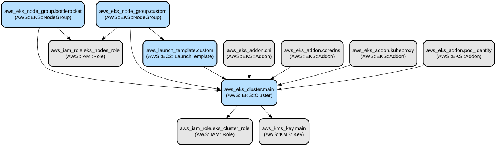

# AWS EKS Infrastructure with Istio Service Mesh and Monitoring Stack

A comprehensive Infrastructure as Code (IaC) solution that deploys a production-ready Amazon EKS cluster with integrated service mesh, monitoring, and autoscaling capabilities using Terraform. The solution provides automated cluster management, observability, and secure networking out of the box.

This project automates the deployment of a complete Kubernetes infrastructure on AWS, including Istio service mesh for traffic management, Prometheus and Grafana for monitoring, Jaeger for distributed tracing, and Karpenter for intelligent node provisioning. It implements security best practices with proper IAM roles, KMS encryption, and network policies while providing scalability through automated node management and load balancing.

## Repository Structure
```
.
├── terraform/                      # Core Terraform configuration files
│   ├── eks.tf                     # EKS cluster configuration
│   ├── helm_istio.tf             # Istio service mesh deployment
│   ├── helm_prometheus.tf        # Prometheus monitoring stack
│   ├── iam_*.tf                  # IAM roles and policies
│   └── variables.tf              # Input variables definition
├── assets/                        # Kubernetes manifests
│   ├── chip.yaml                 # Sample application configuration
│   └── health-api.yaml          # Health check API configuration
├── helm/                         # Helm chart values
│   └── prometheus/              # Prometheus configuration
└── docs/                         # Documentation
    └── infra.dot                # Infrastructure diagram
```

## Usage Instructions
### Prerequisites
- AWS CLI configured with appropriate credentials
- Terraform >= 1.0.0
- kubectl
- helm >= 3.0.0
- An existing VPC with public and private subnets
- Route53 hosted zone (if using provided DNS features)

### Installation

1. Configure AWS credentials:
```bash
aws configure
```

2. Initialize Terraform:
```bash
terraform init
```

3. Review and modify variables:
```bash
cp terraform.tfvars.example terraform.tfvars
# Edit terraform.tfvars with your values
```

4. Deploy the infrastructure:
```bash
terraform plan
terraform apply
```

### Quick Start

1. Configure kubectl for your new cluster:
```bash
aws eks --region us-east-1 update-kubeconfig --name linuxtips-cluster
```

2. Verify the installation:
```bash
kubectl get nodes -o custom-columns=NAME:.metadata.name,CAPACITY_TYPE:.metadata.labels.capacity/type
kubectl get pods -n istio-system
```

3. Monitor Karpenter node provisioning:
```bash
kubectl logs -l app.kubernetes.io/name=karpenter -n karpenter -f
kubectl get nodeclaims -n karpenter
```

4. Access Grafana dashboard:
```bash
# Default credentials:
# Username: admin
# Password: prom-operator
echo "Grafana URL: https://${var.grafana_host}"
```

### Application Testing

#### Chip Application API
Test the filesystem operations:
```bash
# List files
curl -X POST http://chip.chip.svc.cluster.local:8080/filesystem/ls -i -d '{"path": "/data"}'

# Write file
curl -X POST http://chip.chip.svc.cluster.local:8080/filesystem/write -i -d '{"path": "/data/linuxtips-2", "content": "dGVzdGUK"}'

# Read file
curl -X POST http://chip.chip.svc.cluster.local:8080/filesystem/cat -i -d '{"path": "/data/linuxtips-2"}'

# System environment
curl -X POST http://chip.chip.svc.cluster.local:8080/system/environment

# CPU burn test
curl http://chip.cquinta.com/burn/cpu -iv
```

#### Health API Testing
Test the health calculator API:
```bash
# Single request
curl --location --request POST 'http://health.cquinta.com/calculator' \
--header 'Content-Type: application/json' \
--data-raw '{ 
   "age": 26,
   "weight": 90.0,
   "height": 1.77,
   "gender": "M", 
   "activity_intensity": "very_active"
}' --silent | jq .

# Load testing (continuous requests)
while true; do 
  curl --location --request POST 'http://health.cquinta.com/calculator' \
  --header 'Content-Type: application/json' \
  --data-raw '{ 
     "age": 26,
     "weight": 90.0,
     "height": 1.77,
     "gender": "M", 
     "activity_intensity": "very_active"
  }' --silent | jq .
  echo
done
```

### Helm Chart Management

```bash
# Debug helm template
helm template debug helm-cr

# Install or upgrade chart
helm upgrade helm-cr helm-cr --install

# Package helm chart
helm package helm-cr
```

### Debugging and Utilities

```bash
# Create bastion pod for debugging
kubectl run bastionpod --rm -i --tty --image ubuntu -n default -- /bin/bash

# Check AWS addon versions
aws eks describe-addon-versions --addon-name aws-mountpoint-s3-csi-driver

# Test with custom host header
curl <endpoint> -H "Host: xpto.com.br"
```

### Troubleshooting

1. EKS Cluster Access Issues:
- Verify IAM role permissions
- Check AWS CLI configuration
- Ensure VPC endpoints are properly configured
```bash
aws eks describe-cluster --name <cluster-name> --region <region>
```

2. Istio Service Mesh Issues:
- Check Istio pods status
- Verify sidecar injection
```bash
kubectl get pods -n istio-system
kubectl describe pod <pod-name> -n istio-system
```

3. Monitoring Stack Issues:
- Verify Prometheus operator status
- Check Grafana persistent volume claims
```bash
kubectl get prometheuses -n prometheus
kubectl get pvc -n prometheus
```

## Data Flow
The infrastructure implements a multi-tier architecture with secure communication between components through the Istio service mesh.

```ascii
External Traffic → NLB → Istio Ingress Gateway → Service Mesh → Pods
                                ↓
                        Monitoring Stack
                    (Prometheus/Grafana)
                                ↓
                     Distributed Tracing
                         (Jaeger)
```

Key component interactions:
1. External traffic enters through AWS Network Load Balancer
2. Istio Ingress Gateway routes traffic based on virtual service rules
3. Service mesh handles inter-service communication and telemetry
4. Prometheus collects metrics from services and infrastructure
5. Grafana visualizes metrics and provides dashboards
6. Jaeger collects and visualizes distributed traces
7. Karpenter manages node provisioning based on workload demands

## Infrastructure



### Compute Resources
- EKS Cluster (AWS::EKS::Cluster)
- Node Groups managed by Karpenter
- Fargate Profiles for serverless workloads

### IAM Resources
- EKS Cluster Role
- Node Instance Role
- Service Account Roles
- Load Balancer Controller Role

### Storage Resources
- EFS for Prometheus storage
- EFS for Grafana storage

### Networking Resources
- Security Groups for cluster and EFS
- Network Load Balancer
- Target Groups

### Monitoring Resources
- Prometheus Operator
- Grafana Dashboards
- Jaeger Tracing
- Kiali Service Mesh Dashboard